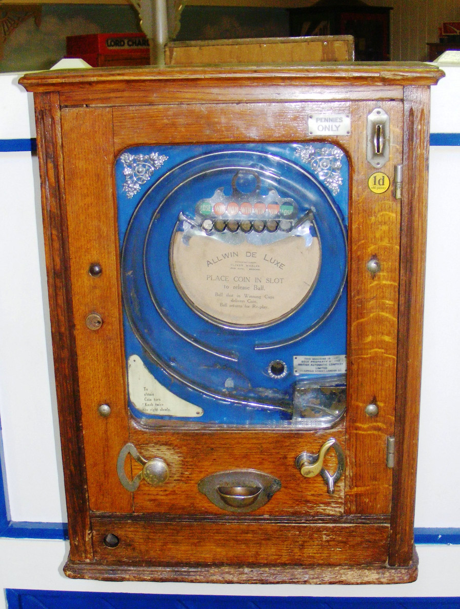

# Early age of Arcade Games

---
When I started to interest about the old games, I was surprised that the origins of the video games industry lie in US and not in Japan as I used to think.

Let's go deeper and find out the truth!

---
# First arcades
The first popular "arcade games" included early amusement-park midway games such as shooting galleries,
ball-toss games, and the earliest coin-operated machines, such as those that claimed to tell a person's fortune or that played mechanical music.

---
# Penny arcade amusement machine

