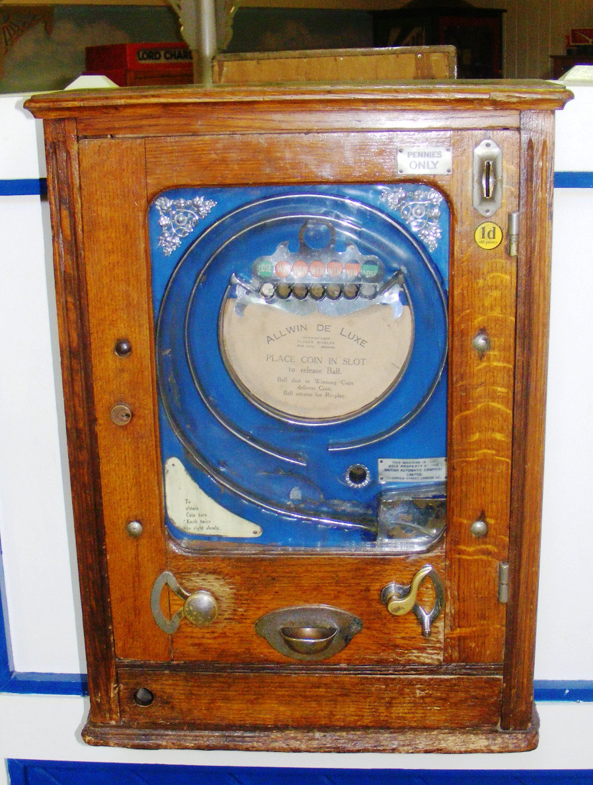
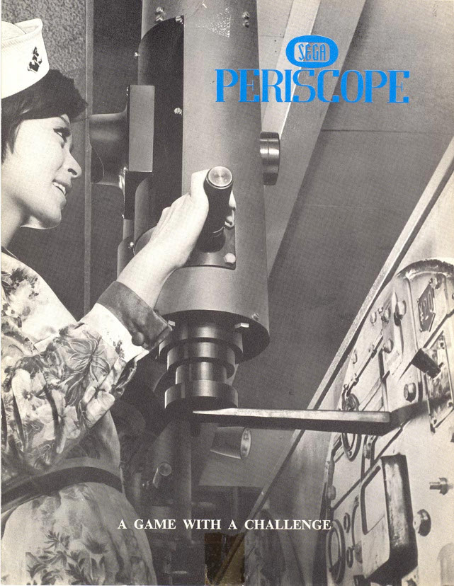

# Early age of Arcade Games

---
When I started to interest about the old games, I was surprised that the origins of the video games industry lie in US and not in Japan as I used to think.

Let's go deeper and find out the truth!

---
# First arcades
The first popular "arcade games" included early amusement-park midway games such as shooting galleries,
ball-toss games, and the earliest coin-operated machines, such as those that claimed to tell a person's fortune or that played mechanical music.

---
# Penny arcade amusement machine

---
In 1940, American businessmen Martin Bromley, Irving Bromberg, and James Humpert formed **Standard Games** in Honolulu, Hawaii.
Their aim was to provide coin-operated amusement machines, including slot machines, to military bases as the increase in personnel
with the onset of World War II would create **demand for entertainment**.

---
# Slot machines

---
After the war, the founders sold _Standard Games_ and established _Service Games_, named for the military focus.
After the United States government **outlawed slot machines in its territories in 1951**, Bromley sent employees Richard Stewart and Ray LeMaire
to Tokyo to establish Service Games of Japan to provide coin-operated slot machines to U.S. bases in Japan.

---
# You know, what's next?

Standard Games >

---
# You know, what's next?

Standard Games > Service Games

---
# You know, what's next?

Standard Games > **SE**rvice **GA**mes

---
# You know, what's next?

Standard Games > **SE**rvice **GA**mes

---
Shortly afterward, Sega stopped leasing to military bases and moved its focus from slot machines to coin-operated amusement machines.
Sega **imports** various mechanical arcades included Rock-Ola jukeboxes, pinball and gun games.

---
The first electromechanical game Sega manufactured was the submarine simulator **Periscope**, released worldwide in the late 1960s.
It featured light and sound effects considered innovative, and was successful in Japan.
It was exported to malls and department stores in Europe and the United States, and helped standardize the 25-cent-per-play cost for arcade games in the U.S.

---
# Periscope game ad poster

---
Not Periscope game but something close to it:

<iframe width="1120" height="620" src="https://www.youtube.com/embed/Sp7lv1lhNJI?start=17" frameborder="0" allow="accelerometer; autoplay; encrypted-media; gyroscope; picture-in-picture" allowfullscreen></iframe>

---
Sega was surprised by the success, and for the next two years the company produced and exported between eight and ten games per year.
That is how SEGA developed from the local the world-wide company.

---
Now let's step back a bit and take a look on the first video games ever.

