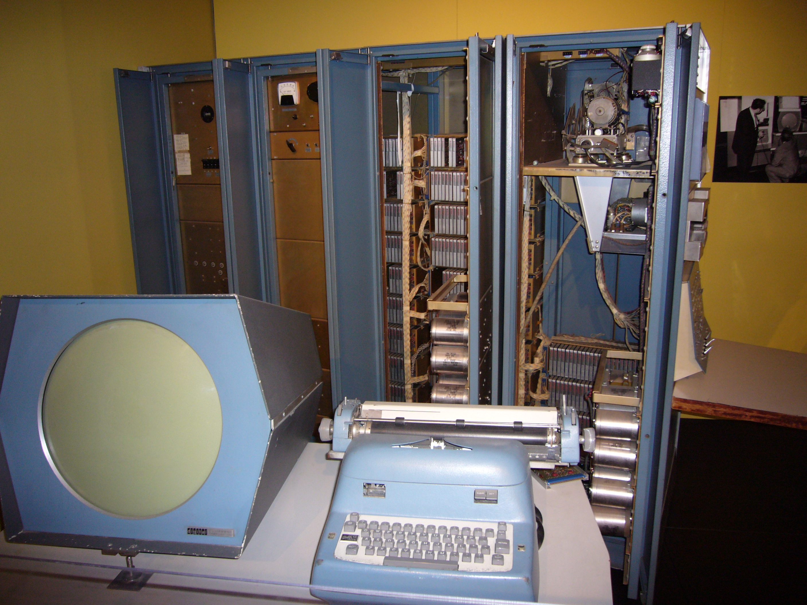
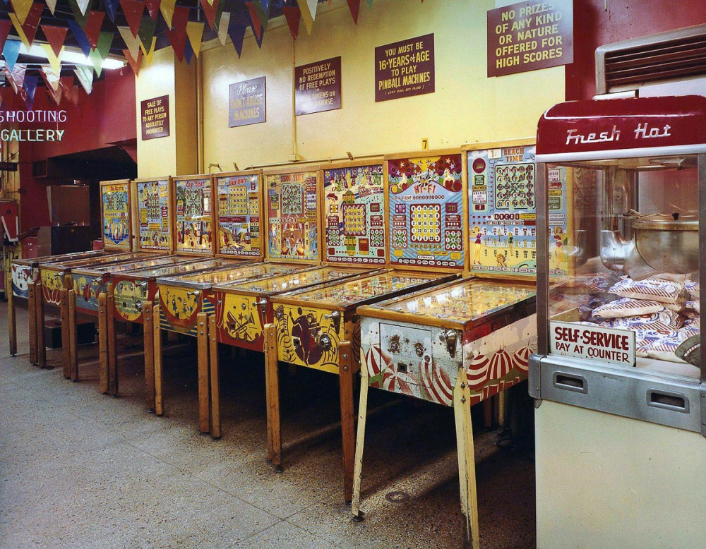

# First video games

---
# Bertie the Brain
_Bertie the Brain_ was an early computer game, and one of the first games developed in the early history of video games.

---
# Bertie the Brain
It was built in Toronto by Josef Kates for the 1950 Canadian National Exhibition.

The four meter  tall computer allowed exhibition attendees to play a game of tic-tac-toe against an artificial intelligence.
The player entered a move on a lit keypad in the form of a three-by-three grid, and the game played out on a grid of lights overhead.
The machine had an adjustable difficulty level. 

After the exhibition, Bertie was dismantled, and "largely forgotten" as a novelty.

---
Other early games include checkers and a various versions of the well-known board and card games.

---
At the time computers were really huge and often don't have any displays, using teletypes as the output device.
<iframe width="1120" height="630" src="https://www.youtube.com/embed/MikoF6KZjm0?start=61" frameborder="0" allow="accelerometer; autoplay; encrypted-media; gyroscope; picture-in-picture" allowfullscreen></iframe>

---
**PDP-1** was one of the new modern computers with CRT display and console typewriter.

---
*Spacewar!* is a space combat video game developed in 1962 by Steve Russell in collaboration with Martin Graetz and Wayne Wiitanen,
and programmed by Russell with assistance from other people, including Bob Saunders and Steve Piner.

---
It was written for the newly installed DEC PDP-1 at the Massachusetts Institute of Technology.

<iframe width="1000" height="562" src="https://www.youtube.com/embed/7bzWnaH-0sg" frameborder="0" allow="accelerometer; autoplay; encrypted-media; gyroscope; picture-in-picture" allowfullscreen></iframe>

---
It was also spread to many of the few dozen (primarily academic) installations of the PDP-1 computer,
making *Spacewar* the first known video game to be played at multiple computer installations.

---
Check the [sources](https://www.masswerk.at/spacewar/sources/spacewar_2b_m_2016.txt): nothing but pure ASM

---
Game was written in almost a half of year. 

While the game was officially banned at some installations
(e.g. BBN outlawed *Spacewar!* occasionally, mainly because of dying control switches), it was also the most important showcase for the PDP-1.

---
Eventually *PDP-1*s shipped with a copy of *Spacewar!* in memory for testing purpose.

Since the machine's magnetic core memory was persistent, the program would be present, when the machine was unpacked and switched on — ready for a test run of *Spacewar!*
This wasn't an outrageous claim at all, since the program utilized nearly every resource of the machine.

---
## PDP-1 specs
* Primary Memory: 4K word core
* CPU clock speed: 187 kHz

---
### Back to first arcade galleries
First arcade galleries (60s) were full of simple mechanical games like pinball and other primitive machines.
People were suspicious to such games as they thought it is a direct way to the other gambling games.

