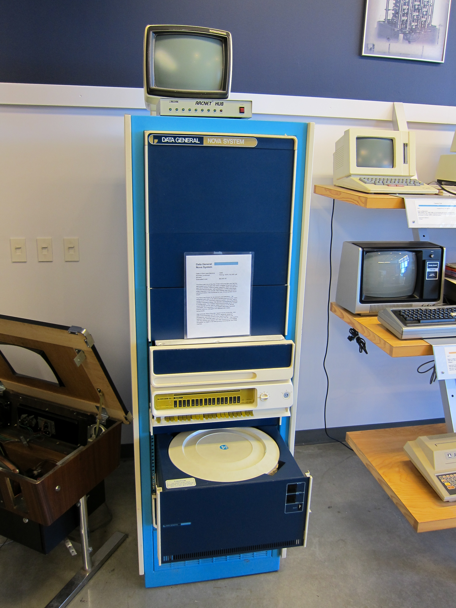
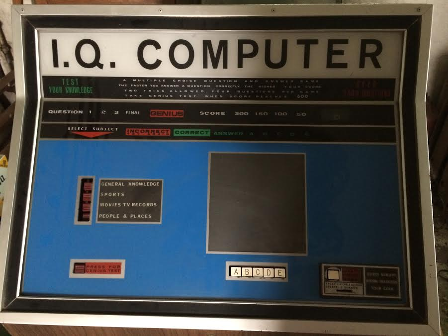
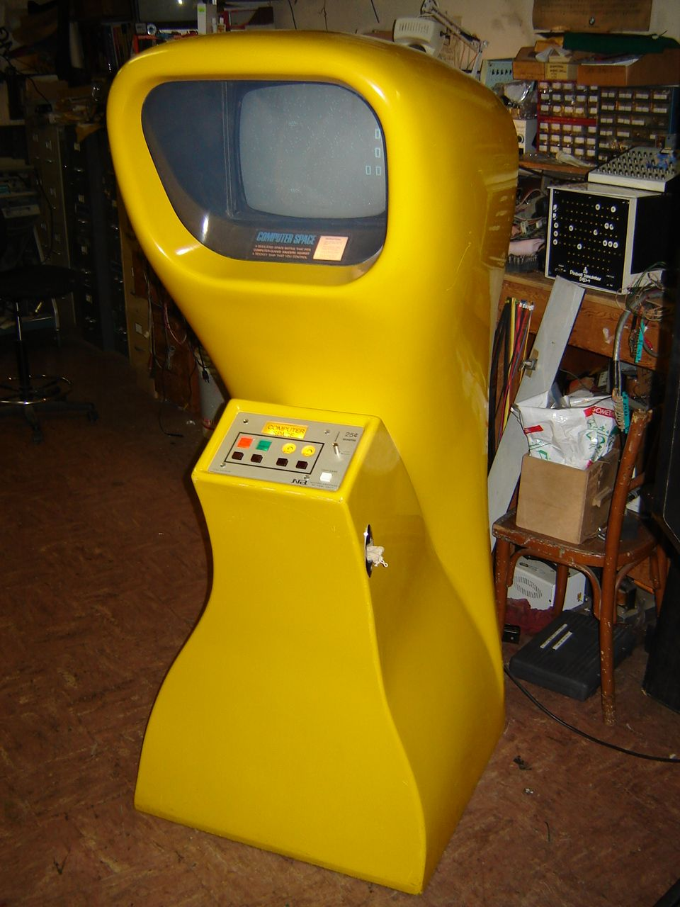
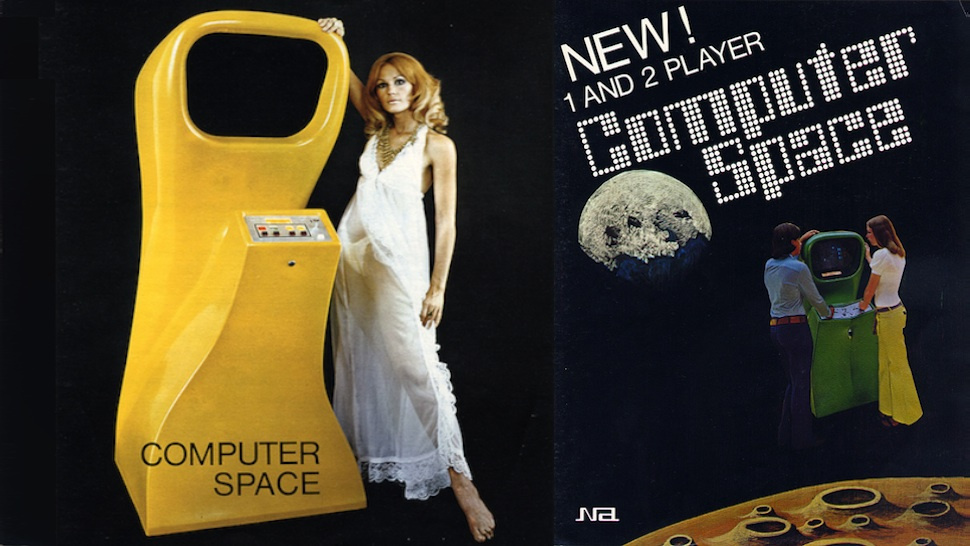

Meet Nolan Kay Bushnell: one of the founder fathers of video games industry who raised it to the new level.

---
Bushnell worked at Lagoon Amusement Park for many years while attending college (once he loose all his money in poker game so had to work to pay for the college).

He liked the concept of getting people curious about the game and from there getting them to pay the fee in order to play.

---
In the late 1960s, Nolan Bushnell saw Spacewar! running on a mainframe at the University of Utah where he was a student.
Bushnell worked during the summer at Lagoon Amusement Park in Utah as a manager of the games department overseeing the arcade games,
and when he saw **Spacewar!** he believed that an arcade game version of the game would be very popular.

---
The high price of computers capable of running the game, however, meant that any such arcade game would not be economically feasible.

---
Soon after, he saw an ad for the Data General Nova computer, which cost only US$4,000 (equivalent to about $25,000 in 2019),
and thought again about his Spacewar arcade game idea; he believed that at that price, if he were able to connect four monitors
and coin slots to allow multiple games to run simultaneously, the game would be economically viable.

---
# Data General Nova computer

---
Bushnell and his mate began to design custom hardware to run the game's functions, and they soon discovered that the cost
to build the whole game's computing systems would be much lower.

On the other hand, however, the custom hardware was not as powerful
as the more expensive Nova computer, which meant that the pair needed to make gameplay modifications.

---
# Computer space
<iframe width="1000" height="562" src="https://www.youtube.com/embed/b3BQsCCwo8w" frameborder="0" allow="accelerometer; autoplay; encrypted-media; gyroscope; picture-in-picture" allowfullscreen></iframe>

---
Spacewar was a two-player game featuring dogfights around the gravitational field of a central star; neither of these features
could be run on the dedicated circuits the pair were making, so the game was cut down to a single-player game wherein the player would fight
against two computer-controlled spaceships in open space.

---
By January 1971, the pair had built some basic hardware which could connect to a monitor, with plans to continue expanding it
to make a game now named Cosmic Combat, but they were still far away from turning what was then a dot moving on a screen into a full Spacewar-like game cabinet.

---
In January 1971, Bushnell and Dabney founded Syzygy Engineering as an official company. 
They approached Ampex and a prior manager of Dabney's with their prototype, but found no interest.

---
During a dentist appointment in early 1971, Bushnell told the dentist about the game and that he was looking for a manufacturer; the dentist in turn referred him to another patient of his, Dave Ralstin, the sales manager for Nutting Associates in Mountain View, California.
Nutting had been founded in 1967 on the basis of [Computer Quiz](https://gameorigo.com/computer-quiz-arcade-1967), an analog quiz arcade game, and by 1971 was looking for another hit game. 

---
# Computer Quiz game

---
After meeting with Bushnell, Nutting felt that his game was the potential success they needed to replace falling sales of Computer Quiz updates, as they had not had a hit game since.
Nutting not only agreed to manufacture the game but also hired Bushnell as their chief engineer, as they had no real engineering team at the time. Furthermore, Syzygy Engineering retained ownership of the game, even though Nutting agreed to give Syzygy space to build the prototype and to manufacture the game once complete. 

---
> _Computer Space_ is a space combat arcade game developed in 1971 as one of the last games created in the early history of video games.
> Computer Space is a derivative of the 1962 computer game Spacewar!, possibly the first video game to spread to multiple computer installations.

---
The game is enclosed in a custom fiberglass cabinet in one of four colors, which Bushnell designed himself to be futuristic.

---
# Reception
Nutting ordered an initial production run of 1,500 units of Computer Space, an optimistic decision given that a hit arcade game
at the time would sell around 2,000 units, though a handful had reached 10,000.

---
Reception to the game from distributors was mixed; while some were excited by the game, others felt it to be confusing
and would amount to nothing more than a passing fad at best.
By spring 1972 the game had sold over 1,000 units, and according to Bushnell in 1976 ended up selling between 1,300 and 1,500 units.

---
While this was a commercial success, making over US$1,000,000 (equivalent to about $6,112,000 in 2019),
it was a disappointment to Nutting, who had been hoping for a large-scale success like Computer Quiz.

---

---
The game's relative lack of success was attributed to the complexity of its controls and a steep learning curve,
which pushed away customers used to less complex games.

---
Bushnell noted that the locations that the game did well in,
like the Dutch Goose playtest location, were generally located near university campuses;
the general market for coin-operated games, however, was in working-class bars, where the patrons were less interested in deciphering a complicated game.

---
In the documentary Video Game Invasion: The History of a Global Obsession, Bushnell explained,
"Sure, I loved it, and all my friends loved it, but all my friends were engineers. It was a little too complicated for the guy with the beer in the bar."

---
Bushnell has also stated that part of the difficulty lay in the novelty of the game; he has said that even a few years later
the controls and gameplay would have been more understandable to players who would have seen other video games by then.

---
Conversely, Bushnell and Dabney have said that the game's novelty was also part of its appeal to players—most people had never seen
a television screen displaying images being controlled by a person in front of it, rather than playing video from a remote television station.
