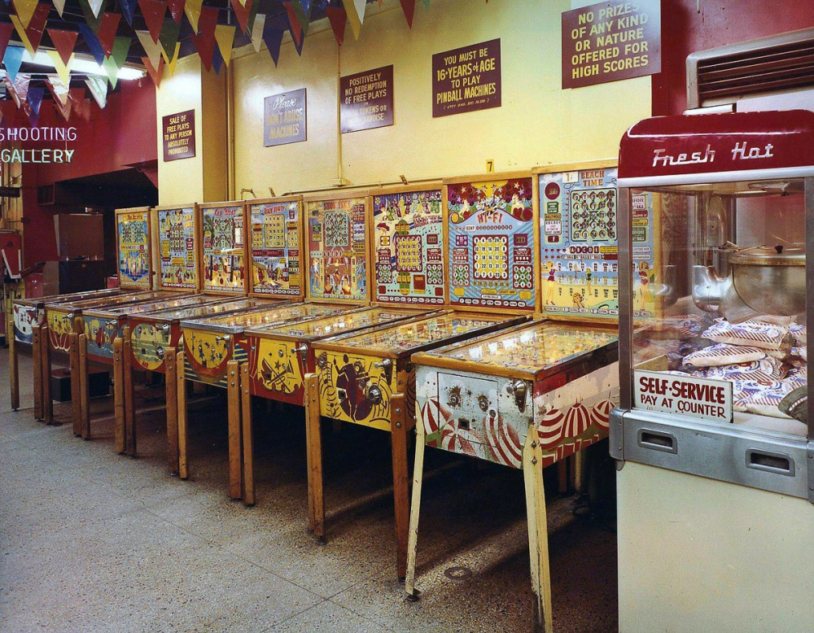
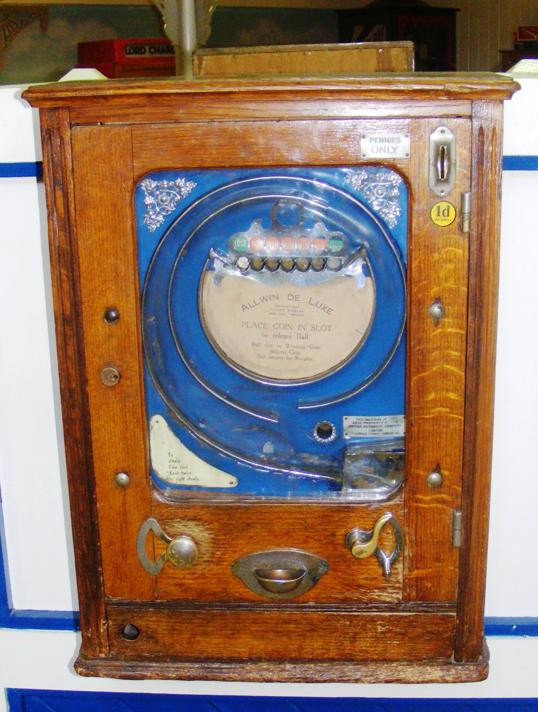

# Early age of Arcade Games

When I started to interest about the old games, I was surprised that the origins of the video games industry lie in US and not in Japan as I used to think. 
Let's go deeper and find out the truth!

## First arcades
The first popular "arcade games" included early amusement-park midway games such as shooting galleries,
ball-toss games, and the earliest coin-operated machines, such as those that claimed to tell a person's fortune or that played mechanical music. 

The old Midways of 1920s-era amusement parks (such as Coney Island in New York) provided the inspiration and atmosphere for later arcade games. 
In the 1930s **the first coin-operated pinball machines** emerged. 
These early amusement machines differed from their later electronic cousins in that they were made of wood.
They lacked plungers or lit-up bonus surfaces on the playing field, and used mechanical instead of electronic scoring-readouts. 

In 1940, American businessmen Martin Bromley, Irving Bromberg, and James Humpert formed **Standard Games** in Honolulu, Hawaii. Their aim was to provide coin-operated amusement machines, including slot machines, to military bases as the increase in personnel with the onset of World War II would create **demand for entertainment**.

After the war, the founders sold Standard Games and established Service Games, named for the military focus. After the United States government **outlawed slot machines in its territories in 1951**, Bromley sent employees Richard Stewart and Ray LeMaire to Tokyo to establish Service Games of Japan to provide coin-operated slot machines to U.S. bases in Japan.

You know, what's next?
Standard Games > Service Games > **SE**rvice **GA**mes > **SEGA**

Shortly afterward, Sega stopped leasing to military bases and moved its focus from slot machines to coin-operated amusement machines. Sega **imports** various mechanical arcades included Rock-Ola jukeboxes, pinball and gun games.

Because Sega imported second-hand machines that required frequent maintenance, it began constructing replacement guns and flippers for its imported games. With some short time, this led to the company developing their **own games**.

The first electromechanical game Sega manufactured was the submarine simulator **Periscope**, released worldwide in the late 1960s. It featured light and sound effects considered innovative, and was successful in Japan. It was exported to malls and department stores in Europe and the United States, and helped standardize the 25-cent-per-play cost for arcade games in the U.S. 

Not Periscope game but something close to it:

Sega was surprised by the success, and for the next two years the company produced and exported between eight and ten games per year.
That is how SEGA developed from the local the world-wide company.

Now let's step back a bit and take a look on the first video games ever.

## First video games
_Bertie the Brain_ was an early computer game, and one of the first games developed in the early history of video games. It was built in Toronto by Josef Kates for the 1950 Canadian National Exhibition. The four meter  tall computer allowed exhibition attendees to play a game of tic-tac-toe against an artificial intelligence. The player entered a move on a lit keypad in the form of a three-by-three grid, and the game played out on a grid of lights overhead. The machine had an adjustable difficulty level. After the exhibition, Bertie was dismantled, and "largely forgotten" as a novelty.

Other early games include checkers and a various versions of the well-known board and card games.

### Spacewar!
At the time computers were really huge and often don't have any displays, using teletypes as the output device.

PDP-1 was one of the new modern computers with CRT display (looks lire radar) and console typewriter.

--> pic

_Spacewar!__ is a space combat video game developed in 1962 by Steve Russell in collaboration with Martin Graetz and Wayne Wiitanen, and programmed by Russell with assistance from other people, including Bob Saunders and Steve Piner. 
It was written for the newly installed DEC PDP-1 at the Massachusetts Institute of Technology. It was also spread to many of the few dozen (primarily academic) installations of the PDP-1 computer, making Spacewar the first known video game to be played at multiple computer installations.
https://www.youtube.com/watch?v=7bzWnaH-0sg

Game was written in almost a half of year. While the game was officially banned at some installations (e.g. BBN outlawed Spacewar! occasionally, mainly because of dying control switches), it was also the most important showcase for the PDP-1. Eventually PDP-1s shipped with a copy of Spacewar! in memory for testing purpose. (Since the machine's magnetic core memory was persistent, the program would be present, when the machine was unpacked and switched on — ready for a test run of Spacewar! This wasn't an outrageous claim at all, since the program utilized nearly every resource of the machine.)

### First arcades
First arcade galleries (60s) were full of simple mechanical games like pinball and other primitive machines. People were suspicous to such games as they thought it is a direct way to the other gambling games.

--> pic

Meet Nolan Kay Bushnell: one of the founder fathers of video games industry who raised it to the new level.

Bushnell worked at Lagoon Amusement Park for many years while attending college (once he loose all his money in poker game so had to work to pay for the college). He was made manager of the games department two seasons after starting. He was particularly interested in the midway arcade games, where theme park customers would have to use skill and luck to ultimately achieve the goal and win the prize. He liked the concept of getting people curious about the game and from there getting them to pay the fee in order to play.

--> pic

In the late 1960s, Nolan Bushnell saw Spacewar running on a mainframe at the University of Utah where he was a student.[9][Note 1] Bushnell worked during the summer at Lagoon Amusement Park in Utah as a manager of the games department overseeing the arcade games, and when he saw Spacewar he believed that an arcade game version of the game would be very popular.[6][11] The high price of computers capable of running the game, however, meant that any such arcade game would not be economically feasible. After graduating from college Bushnell worked as an engineer in California for Ampex, an electronics company that worked in audio and video recording technology.[11] He also met researcher Jim Stein, who worked for Stanford University's Stanford Artificial Intelligence Project; he learned from him that Spacewar was running on the laboratory's PDP-6, and played the game against him there when visiting.[6] Soon after, he saw an ad for the Data General Nova computer, which cost only US$4,000 (equivalent to about $25,000 in 2019), and thought again about his Spacewar arcade game idea; he believed that at that price, if he were able to connect four monitors and coin slots to allow multiple games to run simultaneously, the game would be economically viable.[6][11] He showed his office mate and fellow Ampex engineer Ted Dabney Spacewar at the Stanford laboratory, and the two agreed to work together to try and design a prototype of the game; Bushnell was more experienced with computers and digital engineering, while Dabney was more experienced with analog and hardware engineering, as he had been working on designing video processing and control circuits and power supplies.[12]

https://www.youtube.com/watch?v=b3BQsCCwo8w
_Computer Space_ is a space combat arcade game developed in 1971 as one of the last games created in the early history of video games. Created by Nolan Bushnell and Ted Dabney in partnership as Syzygy Engineering, it was the first arcade video game as well as the first commercially available video game. Computer Space is a derivative of the 1962 computer game Spacewar!, possibly the first video game to spread to multiple computer installations. It features a rocket, controlled by the player, engaged in a missile battle with a pair of flying saucers set against a background starfield. The goal is to score more hits than the enemy spaceships within a set time period, which awards a free round of gameplay. The game is enclosed in a custom fiberglass cabinet in one of four colors, which Bushnell designed himself to be futuristic.

Bushnell and Dabney began to design custom hardware to run the game's functions, and they soon discovered that the cost to build the whole game's computing systems would be much lower.[14] As a result, they would not need to have multiple instances of the game running on the same machine in order to be profitable. On the other hand, however, the custom hardware was not as powerful as the more expensive Nova computer, which meant that the pair needed to make gameplay modifications. Spacewar was a two-player game featuring dogfights around the gravitational field of a central star; neither of these features could be run on the dedicated circuits the pair were making, so the game was cut down to a single-player game wherein the player would fight against two computer-controlled spaceships in open space.[11] By January 1971, the pair had built some basic hardware which could connect to a monitor,[Note 2] with plans to continue expanding it to make a game now named Cosmic Combat, but they were still far away from turning what was then a dot moving on a screen into a full Spacewar-like game cabinet.[7]

# Reception
2-player Computer Space cabinet in 2006, with buttons instead of joysticks
Nutting ordered an initial production run of 1,500 units of Computer Space, an optimistic decision given that a hit arcade game at the time would sell around 2,000 units, though a handful had reached 10,000.[6] Reception to the game from distributors was mixed; while some were excited by the game, others felt it to be confusing and would amount to nothing more than a passing fad at best. By spring 1972 the game had sold over 1,000 units, and according to Bushnell in 1976 ended up selling between 1,300 and 1,500 units.[7] While this was a commercial success, making over US$1,000,000 (equivalent to about $6,112,000 in 2019), it was a disappointment to Nutting, who had been hoping for a large-scale success like Computer Quiz.[11][16] The game's relative lack of success was attributed to the complexity of its controls and a steep learning curve, which pushed away customers used to less complex games.[19] Bushnell noted that the locations that the game did well in, like the Dutch Goose playtest location, were generally located near university campuses; the general market for coin-operated games, however, was in working-class bars, where the patrons were less interested in deciphering a complicated game.[7][11] In the documentary Video Game Invasion: The History of a Global Obsession, Bushnell explained, "Sure, I loved it, and all my friends loved it, but all my friends were engineers. It was a little too complicated for the guy with the beer in the bar."[20] Bushnell has also stated that part of the difficulty lay in the novelty of the game; he has said that even a few years later the controls and gameplay would have been more understandable to players who would have seen other video games by then. Conversely, Bushnell and Dabney have said that the game's novelty was also part of its appeal to players—most people had never seen a television screen displaying images being controlled by a person in front of it, rather than playing video from a remote television station.[6]

